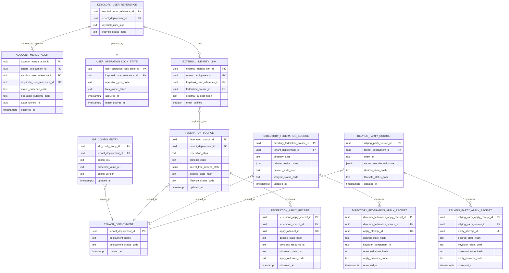

# Keyverse Logical and Persistence ERD

**Status:** Accepted cross-cutting data model. Exact Keycloak internal schema remains Keycloak-owned.  
**Last reviewed:** 2026-08-09

Keyverse persists its own configuration, desired-state, receipts, merge audit, and user-operation locks while Keycloak/PostgreSQL owns canonical IdP users/sessions/clients/federation runtime state. This ERD models Keyverse-owned durable records and their relation to external Keycloak identities without pretending to own Keycloak's internal tables.

## Logical uniqueness constraints

UUID primary identifiers are globally unique. Human/provider identifiers are scoped to the owning tenant or federation source and MUST NOT be interpreted as global keys.

| Entity | Required logical uniqueness |
|---|---|
| `IDP_CONFIG_ENTRY` | `(tenant_deployment_id, config_key)` |
| `FEDERATION_SOURCE` | `(tenant_deployment_id, federation_alias)` |
| `DIRECTORY_FEDERATION_SOURCE` | `(tenant_deployment_id, directory_alias)` |
| `RELYING_PARTY_SOURCE` | `(tenant_deployment_id, client_id)` |
| `KEYCLOAK_USER_REFERENCE` | `(tenant_deployment_id, keycloak_user_uuid)` |
| `EXTERNAL_IDENTITY_LINK` | `(federation_source_id, external_subject_hash)` |

`federation_source_id` defines the identity-provider scope for the external-subject uniqueness rule. Within one federation source, one normalized/hashed external subject may link to at most one Keycloak user reference. This prevents one issuer/provider subject from being attached to multiple users while still allowing unrelated providers to use the same subject string.

Physical migrations must enforce these constraints in the owning Keyverse store. Documentation labels such as `client_id`, `federation_alias`, or Keycloak UUID never authorize cross-tenant lookup by themselves.

Tenant-qualified composite foreign keys are mandatory for cross-entity identity
references. At minimum, the physical schema MUST enforce:

- `EXTERNAL_IDENTITY_LINK (tenant_deployment_id, keycloak_user_reference_id)` →
  `KEYCLOAK_USER_REFERENCE (tenant_deployment_id, keycloak_user_reference_id)`;
- `EXTERNAL_IDENTITY_LINK (tenant_deployment_id, federation_source_id)` →
  `FEDERATION_SOURCE (tenant_deployment_id, federation_source_id)`;
- `ACCOUNT_MERGE_AUDIT (tenant_deployment_id, survivor_user_reference_id)` →
  `KEYCLOAK_USER_REFERENCE (tenant_deployment_id, keycloak_user_reference_id)`;
- `ACCOUNT_MERGE_AUDIT (tenant_deployment_id, duplicate_user_reference_id)` →
  `KEYCLOAK_USER_REFERENCE (tenant_deployment_id, keycloak_user_reference_id)`.

The referenced tenant-qualified pairs MUST be unique keys. A child row carrying
only a globally unique UUID is insufficient evidence of tenant isolation; the
database constraint must reject a mismatched tenant even when application code
or documentation labels are bypassed.

## Identity and authorization rules

- Keycloak UUIDs, federation aliases, RP client IDs, email values, and external subjects are data identifiers, not authorization by themselves.
- Exact external identity key is `(identity_provider, subject)`; verified email may support matching under policy but unverified email never authorizes linking.
- `tenant_deployment_id` is explicit in Keyverse-owned records; deployment/customer separation must not be inferred from realm/resource names.
- Secrets are referenced through protected values/handles where possible; secret-free desired-state tables must never gain client/bind credentials accidentally.

## Desired-state and receipt invariant

Every apply receipt records the exact `desired_state_hash` that was acted on as well as the canonical `observed_state_hash`, outcome, unique `apply_attempt_id`, and observation time. A receipt is current for a source only when its `desired_state_hash` equals that source's current desired-state hash. The latest current receipt is the greatest `observed_at` among receipts for that exact desired-state hash; a receipt for an older hash is historical evidence and cannot establish convergence for a newer desired state.

Retry handling is idempotency-aware. Reusing the same `apply_attempt_id` must return/reuse the same receipt rather than create a second logical attempt. A retry under a new attempt ID may create another receipt, but it remains a distinct attempt and must still bind to the exact desired-state hash. Delete flows that require remote-first semantics cannot remove local desired state before remote deletion succeeds.

## Keycloak ownership

Users, sessions, roles, groups, credentials, WebAuthn material, IdP runtime representation, LDAP storage components, and RP clients ultimately live in Keycloak's schema/API. Keyverse stores controlled references/intent/receipts but does not duplicate or directly edit unsupported Keycloak internal tables.

## Migration acceptance

Changes to Keyverse-owned persistence require migrations/rollback, transaction/concurrency tests, indexes/constraints, tenant isolation, secret/logging tests, backup/restore impact, and ERD/operability/ADR synchronization. Keycloak upgrades require supported schema migration through Keycloak, not custom manipulation of its private database tables.
