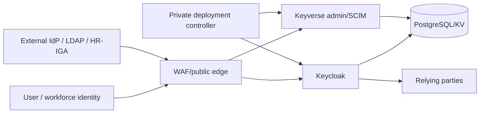

# Keyverse Threat Model

**Status:** Accepted baseline for protected-main identity control plane  
**Last reviewed:** 2026-08-11

## Trust boundaries

## Threat inventory

| Threat | Impact | Required controls |
|---|---|---|
| unverified-email linking | account takeover | never auto-link/merge on unverified email; exact issuer/subject precedence |
| issuer/subject confusion | cross-IdP identity collision | provider-scoped subject identity and closed federation config |
| SAML/OIDC/LDAP secret disclosure | tenant compromise | private deployment payloads, redacted responses/logs, protected secret store |
| malicious federation endpoint | SSRF/credential exfiltration | side-effect-free preflight, explicit apply egress/TLS policy, approved hosts |
| insecure LDAP | credential disclosure/tampering | LDAPS-only current profile, bounded timeout, read-only, Kerberos disabled |
| duplicate Keycloak resources | wrong object mutated | exact search and fail-closed duplicate classification |
| forged Location/resource ID | privileged path misuse | validate resource UUID/path before follow-up transport |
| desired-state/remote divergence | false operational status | persist intent, exact re-observation, canonical receipt, reconciliation |
| local-first delete | false deletion / drift | remote-first deletion where required |
| SCIM/merge race | lost updates/account resurrection | shared cross-process user-operation lock and transaction tests |
| tombstone reprovisioning | duplicate account resurrection | survivor pointer + disabled duplicate policy |
| password fallback | weakens passwordless policy | portable flow contains no password authenticator |
| RP redirect/origin mistake | auth-code/token theft | exact HTTPS/PKCE/client policy; separate native loopback profile |
| arbitrary protocol mapper | excessive claims/code execution | closed mapper classes/claims; PR #72 integrated in protected main |
| raw secret in desired state | leakage and poor rotation | secret-free RP source + separate credential provisioning |
| automation credential exposure | repository/provider compromise | isolated OpenCode/broker/verification/publication and reviewer separation |
| stale/false-green CI | unverified identity policy lands | exact-head checks, success-only evidence, fail-closed API gate |
| RP accepts identity without authorization boundary | cross-tenant access or privilege elevation | explicit issuer/audience/JWKS profile, tenant/resource ABAC before bounded RBAC, cross-tenant denial tests, production fail-closed defaults |

## STRIDE interpretation

- **Spoofing:** external identities require exact issuer/provider + subject and protocol validation; unverified email is insufficient.
- **Tampering:** desired state and receipts are versioned/auditable; duplicates fail closed; mutations re-observe live state.
- **Repudiation:** merge, provisioning, federation, RP, and deployment mutations require durable intent/outcome evidence and actor/correlation context.
- **Information disclosure:** credentials, private payloads, bind DNs, tokens, provider error bodies, and protected identity data are minimized/redacted at public boundaries.
- **Denial of service:** API bodies, directory/provider configs, retries/timeouts, SCIM mutation rate, external lookups, queues, and automation loops are bounded.
- **Elevation of privilege:** public client IDs, email, UUIDs, or model output never create admin/reviewer/release authority.

## Current protected-main versus operational acceptance

Protected main has passwordless realm policy, account unification/SCIM,
federation/directory/RP desired state, deployment boundaries, the PR #72 closed
RP mapper profile, and the PR #74 fail-closed hourly automation boundary.
Both integrated changes still require the protected-main operational acceptance
described in `docs/OPERABILITY.md`.

## Required security tests

- verified versus unverified email linking;
- issuer/subject collisions and explicit link;
- merge/SCIM concurrency and tombstone behavior;
- passwordless registration rollback;
- SAML/OIDC/LDAP/RP closed-schema hostile inputs;
- no preflight DNS/socket/HTTP/Keycloak/store side effects;
- LDAPS/read-only/trustEmail=false current directory policy;
- duplicate remote resource classification;
- Keycloak Location/resource-ID path validation;
- remote-first delete/re-observation/receipt integrity;
- secret redaction and template scanning;
- RP redirect/origin/logout/PKCE/audience/claim acceptance;
- per-RP invalid issuer/signature/expiry/audience, tenant mismatch, role elevation, ownership, purpose, and cross-tenant denial;
- automation secret isolation, egress, exact-head check classification, and independent review authority.

## Review triggers

Revisit for a new authenticator, linking evidence source, external protocol, mapper class, directory write mode, Kerberos, secret ownership change, admin API exposure, data-store boundary, new tenant model, new RP, changed claim-to-tenant mapping, or altered development/release credentials.
