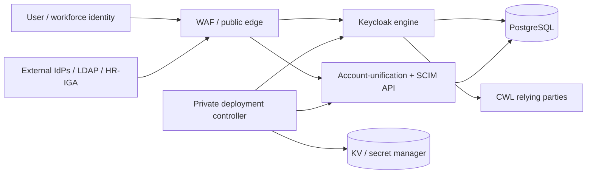
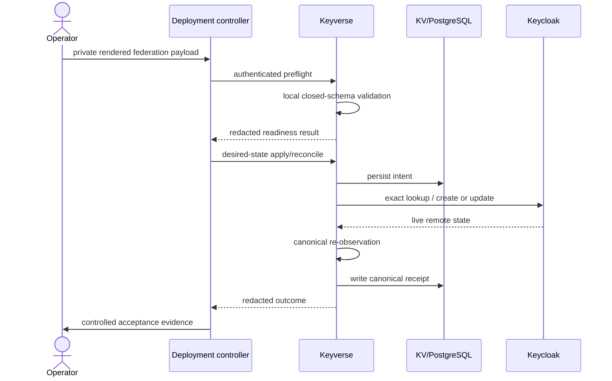
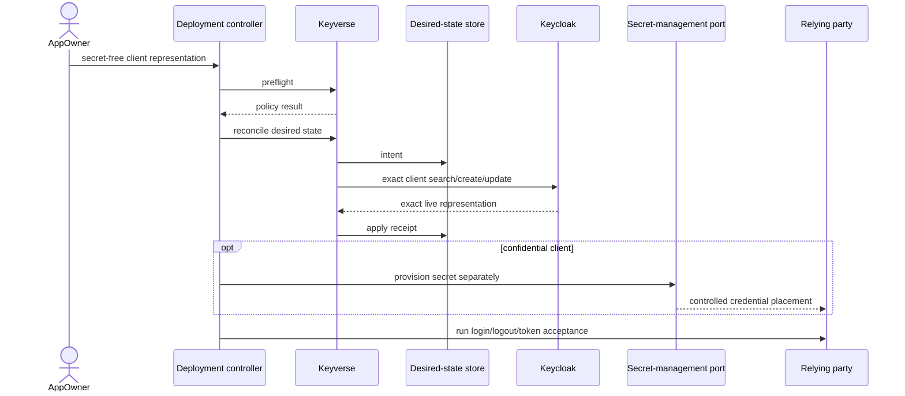
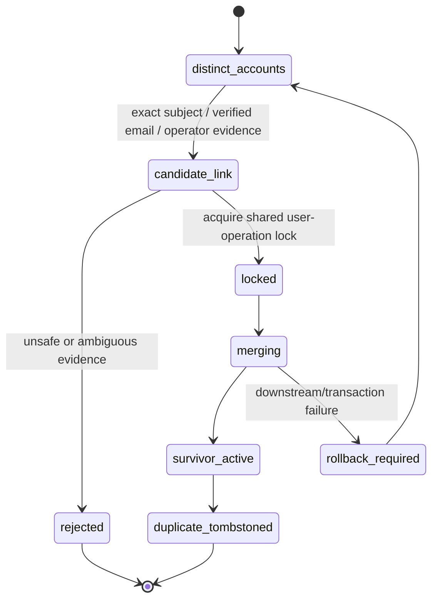
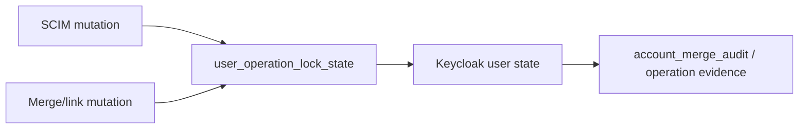
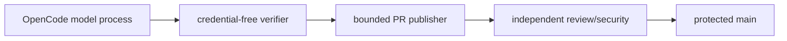

# Keyverse UML and Runtime Views

**Status:** Accepted protected-main diagrams with active-PR items labelled.  
**Last reviewed:** 2026-08-09

## Component and authority view

## Federation desired-state sequence

## RP registration sequence

PR #72 extends this sequence with a closed mapper profile; it remains active-PR.

## Account merge state view

Unverified email cannot enter `candidate_link` by itself.

## SCIM / merge concurrency authority

## Automation authority

PR #74 changes exact hourly gate implementation but not this authority separation.

## Maintenance rule

Update these views whenever Keycloak/Keyverse/deployment-controller ownership, identity matching, desired-state lifecycle, secret boundary, persistence, or protected automation authority changes. Active-PR items must not be relabelled as protected-main until integrated.