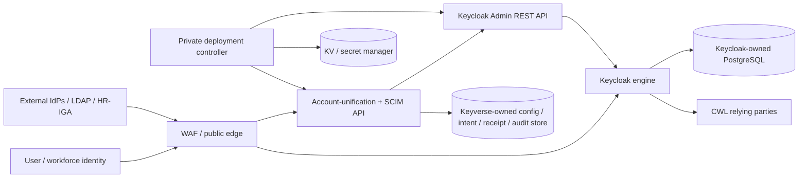
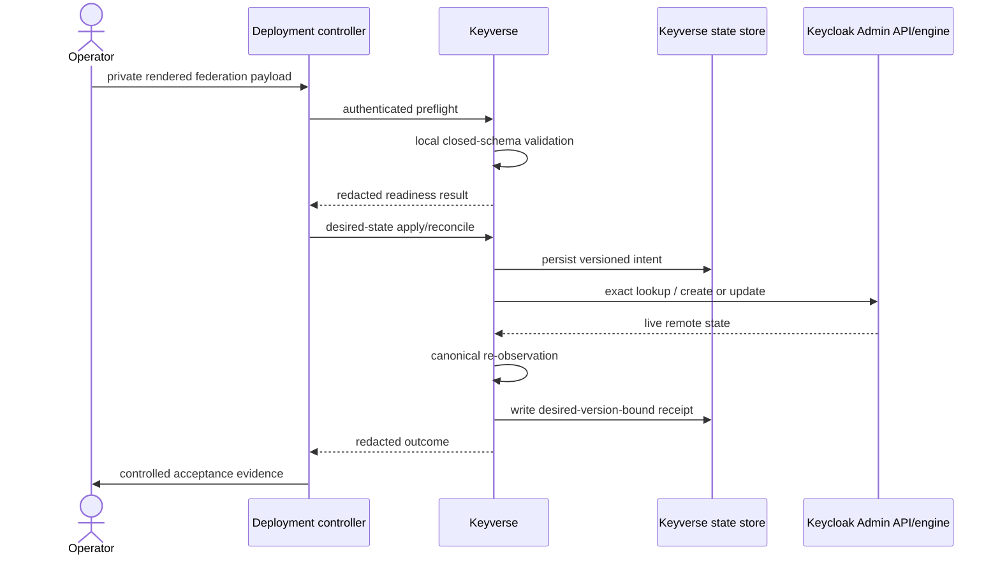
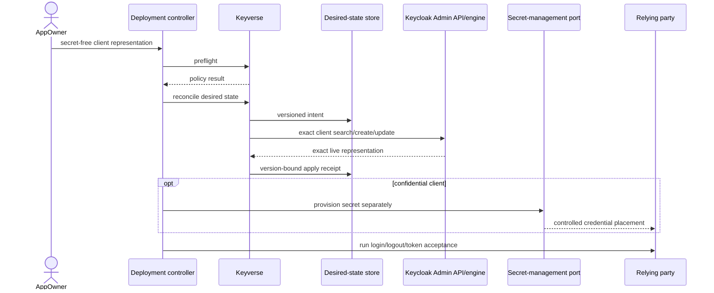
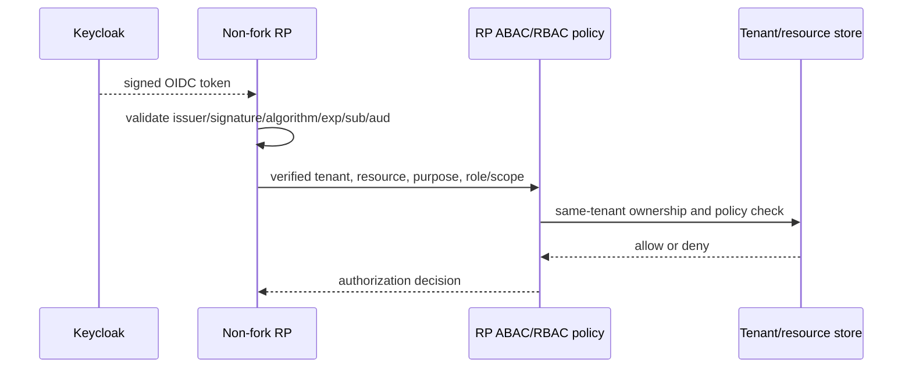
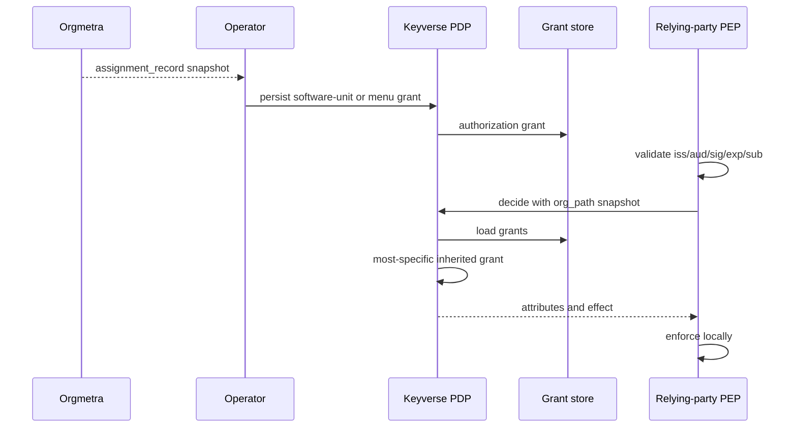
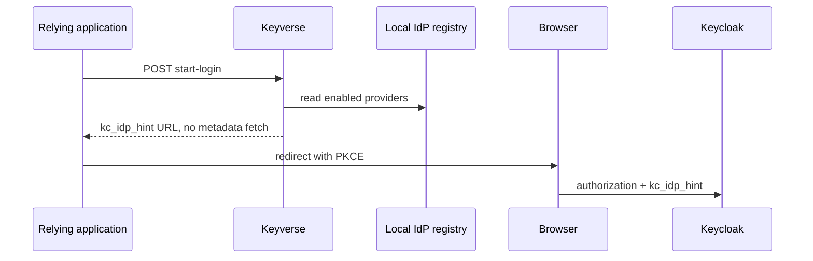
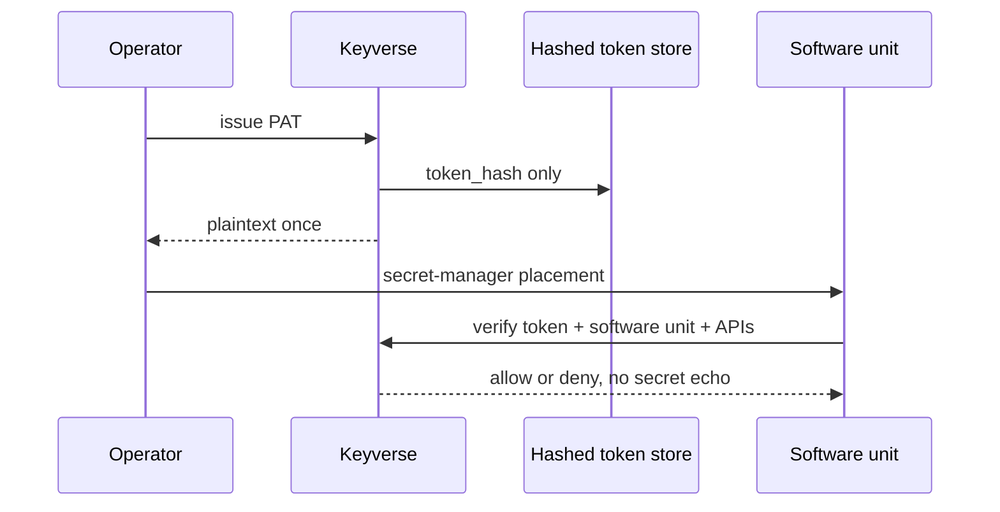
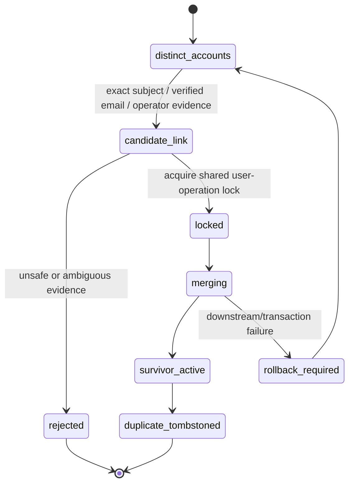
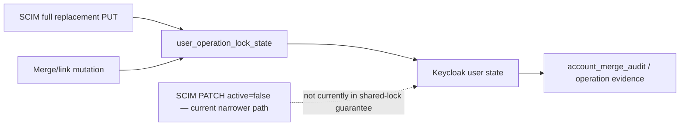
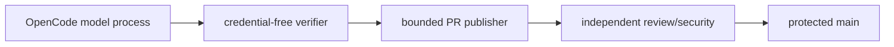

# Keyverse UML and Runtime Views

**Status:** Accepted protected-main diagrams with integrated changes labelled.
**Last reviewed:** 2026-08-18

## Component and authority view

The two storage nodes are authority boundaries, even when a deployment places them on the same physical database service. Keycloak owns and migrates its internal schema. Keyverse reads/writes only its own supported store and reaches Keycloak user/client/federation state through the supported Admin API rather than direct private-table access.

## Federation desired-state sequence

## RP registration sequence

PR #72 extends this sequence with a closed mapper profile and is integrated
in protected main; downstream authorization acceptance remains deployment
specific.

Downstream authorization is a separate sequence after token issuance:

Authentication, client reconciliation, mapper presence, and Keyverse PDP
receipts do not bypass the RP policy sequence. ADR-0008 records the audited
status of each non-fork RP. ADR-0010 adds an issuer-side decision that the RP
may consult after token validation.

## Hierarchical authorization decision

Orgmetra remains employment SoR. Keyverse never copies the org tree.

## App start-login helper

## Programmable application token

## Account merge state view

Unverified email cannot enter `candidate_link` by itself.

## SCIM / merge concurrency authority

Protected `main` guarantees the shared cross-process lock for merge/link and full SCIM replacement. The current `PATCH active=false` path is explicitly not represented as serialized with merge. Extending that guarantee is a source-and-concurrency-test change, not a documentation relabel.

## Automation authority

PR #74 is integrated in protected main and changes the exact hourly gate
implementation without changing this authority separation; a protected-main
scheduled or manual run remains operational evidence.

## Maintenance rule

Update these views whenever Keycloak/Keyverse/deployment-controller ownership, identity matching, desired-state lifecycle, secret boundary, persistence, or protected automation authority changes. Active-PR items must not be relabelled as protected-main until integrated.
