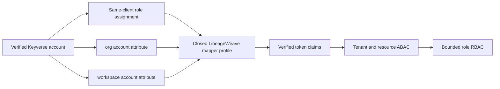

# ADR-0009: Bind LineageWeave relying-party claims to Keyverse accounts

**Status:** Accepted
**Date:** 2026-08-13

## Context

LineageWeave requires real Keyverse accounts. Its company and PU dimensions are
authorization attributes, not substitute login identities. The existing
Keyverse relying-party mapper profile can emit only static routing claims, which
cannot prove that a current session belongs to the account represented by its
`sub` claim.

Keycloak documents separate built-in mappers for a user's client roles and for
custom user attributes. A generic mapper editor would expose unnecessary
issuer-side authority, including cross-client roles, arbitrary user attributes,
groups, scripts, claim names, and token destinations. That conflicts with the
closed desired-state boundary and with the downstream ABAC-before-RBAC contract
in ADR-0008.

## Decision

Keyverse accepts one separately reviewed confidential relying-party profile for
`lineageweave-web`. The profile contains exactly these four ordered mappers:

1. `keyverse-audience`: an audience mapper self-pinned to `lineageweave-web`.
2. `keyverse-account-role`: a client-role mapper pinned to the same client,
   with no role prefix and a multivalued `role` claim.
3. `keyverse-account-org`: a scalar user-attribute mapper from `org` to `org`.
4. `keyverse-account-workspace`: a scalar user-attribute mapper from
   `workspace` to `workspace`.

All four mappers use the exact reviewed access-token, ID-token,
introspection-token, and UserInfo destinations. The three account-derived
claims are atomic: they must all be present, must not mix with hardcoded claims,
and cannot be extended by configuration. The desired-state representation has
no client-secret field; confidential-secret placement remains a separate
approved secret-management operation.

The Keyverse post-import declarative user profile declares `org` and
`workspace` as product authorization attributes, alongside the Keycloak
built-in account attributes required because its Admin API replaces the whole
profile rather than patching it. Both product attributes are scalar, maximum
64 characters, visible/editable only to administrators, and intentionally
optional during initial account creation. Keycloak applies an administrator
role requirement to Admin REST user creation, so requiring either attribute
would make the passwordless registration endpoint unable to create an
unassigned account. Operators must assign both values before LineageWeave
routing; the receiving application rejects missing claims before authorization.
In the pinned Keycloak 26.3.2 runtime, the closed
unmanaged-attribute policy is represented by an omitted/null value; its enum
does not accept the documented `DISABLED` string, and its implementation denies
unmanaged attributes when that value is null. Keycloak's realm-import
representation does not accept this profile, so a one-shot Compose bootstrap
reconciles it only after the realm is healthy. This keeps the issuer from
silently accepting arbitrary account metadata while preserving operators'
ability to assign the two reviewed ABAC dimensions.

The receiving application must validate issuer, signature/algorithm, expiry,
subject, and audience before reading these claims. It must reject a missing,
empty, or non-scalar `org` or `workspace` claim before any tenant/resource ABAC
or recognized-role RBAC decision, then bind both values to the requested
resource. A green Keyverse preflight or apply receipt is not controlled login
or authorization evidence.

### Normative tenant mapping

For this profile, `org` is the opaque external tenant key. It has exactly one
trimmed scalar value per token and is mapped by the receiving application to
exactly one local tenant record through a verified configuration or membership
lookup; it is never inferred from client ID, subject, email, or role.
`workspace` is a child namespace under `org`, also with exactly one trimmed
scalar value per token. It is not a replacement tenant key: a consumer must
prove that the workspace belongs to the resolved organization before resource
lookup.

The profile does not represent multiple memberships. Multiple memberships are
not represented by comma-separated values, arrays, or delimiter conventions.
If membership resolution is ambiguous, missing, or maps either claim to more
than one local record, the consumer must deny before ABAC or RBAC. Operators
must issue a new token or session renewal after an organization, workspace, or
membership change; existing tokens remain bounded by their configured expiry
and must never be reinterpreted as a new tenant binding.

This is a normative mapping from the existing `org` and `workspace` claims,
not a new `tenant` mapper. A future multi-membership or scalar-tenant profile
requires a separate ADR, RED regression, and downstream acceptance evidence.

## Options considered

1. Keep static `role`, `org`, and `workspace` claims. Rejected because they do
   not bind the current authenticated account to company or PU attributes.
2. Permit generic Keycloak user/role/group mappers. Rejected because arbitrary
   issuer-side mappings expand authorization authority and cannot be reviewed
   from a stable desired-state contract.
3. Use the exact four-mapper account-derived profile. Accepted because it binds
   the needed claims to one Keyverse account and one client while retaining
   deterministic validation and reconciliation.

## Consequences

- Identity operators must provision a real Keyverse account with the two named
  administrator-managed attributes and an allowed `lineageweave-web` client
  role before user routing; an identity-only account may exist before that
  assignment, but a missing attribute is a failed provisioning state, not a
  downstream authorization default.
- Account and role changes take effect through Keycloak session/token lifecycle;
  operators must test downgrade and revocation behavior in controlled runtime
  acceptance.
- The profile does not authorize a resource on its own. LineageWeave must retain
  tenant/resource ABAC and only then apply its bounded role map.
- Any extra attribute, group, mapper type, audience, claim name, or token
  destination requires a new ADR, RED regression, and downstream acceptance
  evidence.

## Acceptance evidence

The implementation has local RED-to-GREEN validation, mapper-observation, and
secret-free-template tests. It also has a live Keycloak 26.3.2 API acceptance:
the full profile PUT returns success, returns both reviewed attributes, and
omits `unmanagedAttributePolicy` after reconciliation. Before production use,
record authenticated Keyverse preflight and reconciliation receipts, private
credential placement, a real account authorization-code/PKCE exchange, token
claim shape, cross-tenant denial, role downgrade, logout, and rollback
evidence. Until then the profile is an accepted contract, not a deployed-login
claim.

## References

Keycloak Project. (2026). *Protocol mappers*. Retrieved August 13, 2026, from
https://www.keycloak.org/admin-api/protocol-mappers

Keycloak Project. (2026). *Keycloak Admin REST API*. Retrieved August 21, 2026,
from https://www.keycloak.org/docs-api/latest/rest-api/index.html

Keycloak Project. (2026). *Server Administration Guide* (User profile).
Retrieved August 14, 2026, from https://www.keycloak.org/docs/latest/server_admin/

Lodderstedt, T., Bradley, J., Labunets, A., & Fett, D. (2025). *Best current
practice for OAuth 2.0 security* (RFC 9700). Internet Engineering Task Force.
https://doi.org/10.17487/RFC9700
