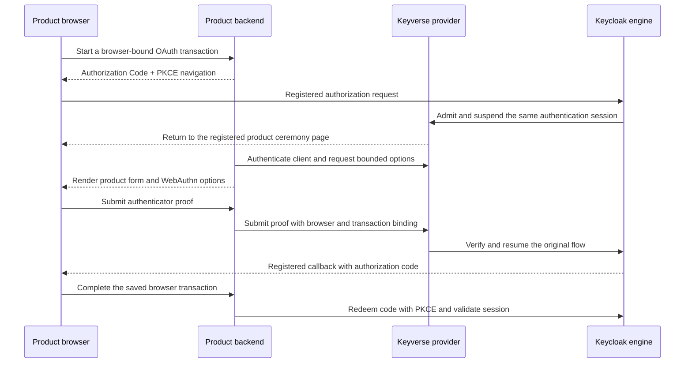

# ADR-0019: Product-rendered passkey ceremonies with Keyverse verification

## Context and Problem Statement

A person must be able to sign in, register, and recover access using the
product's own forms. Keyverse must continue to own the account, credential
verification, recovery authority, and token issuance. A themed issuer page,
popup, or iframe does not meet the rendering requirement.

Protected `main` at `7d9151cd2da260e118020c938c7358e2ee75d541` provides
passwordless registration followed by issuer-rendered required actions.
PR #128 at `e1cf0807d6b15e8d8300eb252533aa05b20b93c9` keeps password
registration unavailable and has no product-rendered ceremony implementation.
ADRs [0017](0017-naruon-owned-password-form.md) and
[0018](0018-naruon-password-credential-issuance.md), formerly numbered
0014/0015 in this PR, preserve the rejected password mechanism's history.
This proposal neither accepts them nor changes the deployed browser flow.

## Decision Drivers

- Product ownership of every local-account form, including failure and recovery.
- ADR 0002's passwordless policy and ADR 0008's identity/authorization boundary.
- Credential verification by the existing engine, with no copied verifier or
  consumer credential database.
- Exact origin, client, session, and credential scope; migration without lockout.
- Independently verifiable release and rollback before consumer adoption.

## Considered Options

1. Issuer-rendered pages in a theme, iframe, popup, or webview.
2. Password grants or consumer-held Keycloak Admin credentials.
3. A Keyverse-owned Keycloak provider exposing bounded ceremony steps while
   retaining Authorization Code + PKCE and native credential verification.

## Decision Outcome

Choose option 3 as the implementation direction, subject to the confirmation
gates below. Extend the engine through its REST, Authentication, Required
Action, and Action Token interfaces. One version-pinned provider module is
the proposed packaging boundary; no additional authentication service is
required. Java is justified only by the Keycloak extension ABI. It does not
authorize adding a Python service or rewriting cryptographic verification in
another language.

The extension guide documents those interfaces, not a ready-made headless
passkey API. Reusing them for product rendering is this proposal's design
inference. Keycloak 26.3.2 is the observed owner runtime and current deployment
pin; latest documentation describes 26.7.3 and cannot prove 26.3.2 compatibility.
Implementation must compile against and exercise the exact selected engine
version, including any separately reviewed security upgrade.

### Product and owner contract

The following are logical operations, not released endpoint names or an
existing schema. Before consumer implementation, publish a versioned JSON
schema and conformance fixtures from Keyverse.

| Operation | Product work | Keyverse authority and completion |
|---|---|---|
| Login | Establish a backend-held OAuth transaction; render passkey instructions; call `navigator.credentials.get()` and submit the assertion. | Admit the client, suspend the original authentication session, verify the assertion with the engine, finish required actions, and resume that same authorization flow. |
| Signup | Render account and email-verification forms; call `navigator.credentials.create()` for enrollment. | Reuse registration validation and initialization compensation; verify email ownership and attestation; store the credential in the engine and complete enrollment. |
| Recovery | Render proof entry, replacement enrollment, and a clear completion or retry state. | Verify a previously bound recovery method; permit only replacement enrollment; notify the account owner, rotate recovery material, and revoke affected credentials/sessions. |

Protocol redirects may occur without displaying issuer-rendered local-account
forms. The registered callback receives the normal authorization code. The
product backend redeems it with PKCE and validates the resulting OIDC session;
the ceremony API never returns an alternative JWT or bypasses token issuance.
Federated IdPs retain their own authentication pages and policies.

### Origin and RP ID migration

Each admitted client needs exact product origins, callback destinations, and
an explicit RP ID profile. No wildcard, caller-supplied origin, public-suffix
RP ID, or inferred production domain is allowed. A credential scoped to the
issuer does not automatically work at a product origin: WebAuthn constrains
the RP ID to the invoking origin's domain or a valid registrable suffix.

Before enabling a product, inventory its existing credential scopes privately
and prove compatibility or reenroll while a working authenticator remains.
An unrelated product domain requires its own compatible credential scope;
never widen an existing scope or copy a credential between accounts. The
implementation must demonstrate how the pinned engine separates these scopes.
If it requires new persisted credential metadata, decide that schema and
migration before coding it. Until then, incompatible origin profiles stay
unavailable; the full product requirement remains incomplete.

### Interaction and mutation invariants

Every interaction binds the realm, admitted confidential client, product
origin, registered callback, authentication session, OAuth state/nonce and
PKCE challenge, browser transaction, intent, challenge, and expiry. The backend
authenticates as that client and checks its existing browser transaction before
fetching or completing a step. A leaked opaque handle alone grants no authority.
Never accept an account identifier supplied by the completion request as the
identity established by the saved interaction.

Reuse engine session/action-token facilities for lifetime and consumption;
prove atomic single-use behavior across concurrent requests and engine nodes.
A stale, cancelled, replayed, mismatched, disabled-account, or unavailable
interaction cannot issue a code, verify email, bind a credential, or alter an
account. A timed-out completion is reconciled against the owner transaction;
it must not blindly repeat account creation or credential binding.

No password, client secret, private key, assertion, recovery proof, or opaque
interaction handle belongs in a log, analytics event, browser storage, or
repository artifact. Product responses expose bounded steps and public
WebAuthn options only. Error copy must avoid account enumeration and preserve
an actionable retry/cancel path. Apply CSRF protection and abuse controls to
start, proof, resend, and completion operations, including distributed calls.

### Recovery assurance

A remaining bound authenticator may authorize replacement enrollment after
reauthentication. For loss of all authenticators, the proposed minimum is a
saved recovery code plus an issued code sent to a previously verified recovery
address. Store saved codes hashed, throttle proof attempts, consume them once,
and notify on recovery and replacement. These requirements draw on NIST's
account-recovery guidance; they do not establish an AAL certification.

An email match, newly supplied address, ordinary product session, or operator
registration token alone cannot authorize recovery. Users without established
recovery material need an explicitly governed recovery route; do not create
a password fallback or claim this case is solved. Keycloak's backup second
factor feature is not assumed to implement this lost-only-passkey policy.

### Consequences

- Product forms can remain consistent while one owner verifies credentials
  and issues tokens. Native engine storage and existing registration are reused.
- The provider becomes an engine-version compatibility obligation. Cross-origin
  migration and recovery add real implementation and operational work.
- Availability depends on the owner ceremony service. Its failure must leave
  an honest unavailable/retry state rather than an insecure fallback.

### Confirmation

No implementation or release is claimed by this document. Complete these
gates in order, retaining exact source, image, schema and consumer versions:

1. **Engine experiment:** implement and exercise one login start/complete flow
   against the pinned engine, with an actual product-origin WebAuthn assertion
   and normal code/PKCE exchange. Demonstrate verifier reuse and required-action
   handling; no scraped HTML or copied authentication engine.
2. **Authority negatives:** wrong client/origin/RP ID/session/intent/PKCE;
   tampered assertion or attestation; expired/replayed/cancelled interaction;
   missing browser binding; disabled or merged account; concurrent double
   completion across two engine instances. Each must produce zero unauthorized
   account, credential, verification, or token side effects.
3. **Enrollment and recovery:** unverified email, resend/replay, mail failure,
   partial initialization, lost-only-passkey proof combinations, exhausted
   attempts, concurrent revocation, and crash-after-commit reconciliation.
   Prove no orphan account or bypassed required action.
4. **Product acceptance:** real authorized account login/signup/recovery,
   keyboard and accessible error states, all eight requested locales and narrow
   layouts in the consumer. Record real browser evidence without credentials or
   identifiable records. Owner tests cannot replace these rendered journeys.
5. **Release/rollback:** protected approval and full security/test gates,
   immutable provider and engine image, SBOM/provenance and schema release;
   rehearse disabling new ceremonies without deleting accounts or credentials,
   draining/invalidation of interactions, and restoring the previous engine.
   Adopt only the released owner contract in each product.

## Pros and Cons of the Options

- Issuer pages reuse the most existing code, but fail the explicit rendering
  requirement, even inside a product frame.
- Password grants are simple to call, but conflict with current OAuth browser
  guidance and the passwordless policy. Giving a consumer Admin credentials
  expands authority beyond login and is rejected independently.
- The provider adds deployment and compatibility work, but is the smallest
  identified owner extension that can preserve both rendering and credential
  authority. Its feasibility still needs the engine experiment above.

## More Information

The dated sources and observed runtime boundary are recorded in
[the ceremony doctoring record](../doctoring/2026-09-07-product-passkey-ceremonies.md).
ADRs 0017/0018 remain Proposed historical alternatives; accepting this proposal
requires an explicit subsequent status/lineage change, never a silent promotion.
