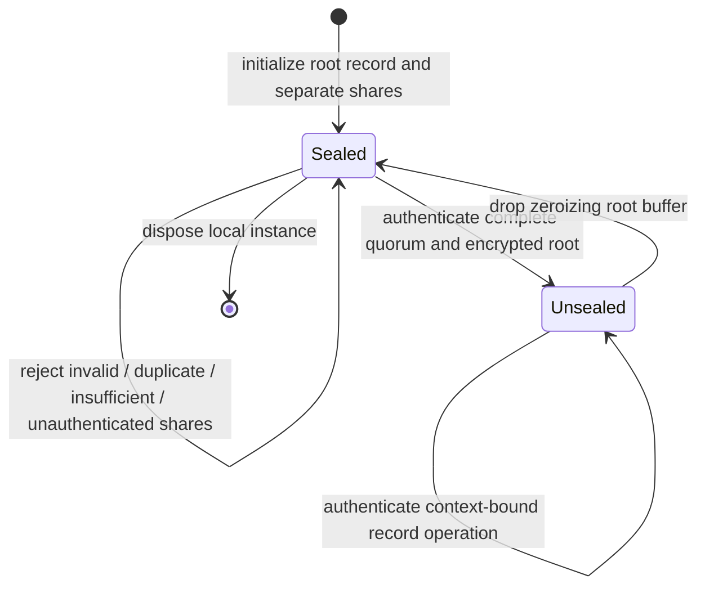

# Native custody barrier evidence — 2026-09-10

Status: source prepared on Keyverse #153; native execution and production acceptance unverified.
Organization owner register: ContextualWisdomLab/.github#2063.

## Implemented scope and exclusions

The internal Rust module in `services/key_custody` owns the wrapping-root seal boundary. It initializes without Keycloak, a database, a credential file, another Keyverse or an external KMS. It uses pinned existing cryptographic implementations rather than custom cipher/KDF/Shamir arithmetic. It is not a public workload resolver or a deployment service.

Required public state sequence:

A separately restored root record starts sealed. Authenticated encryption does not prevent replay of an old valid record. Caller authorization, authenticated custodian enrollment, durable audit, atomic storage, monotonic rollback evidence and key/credential lifecycle remain necessary service-layer work. No network route or consumer wiring is added before those gates.

## Source and verification chronology

Initial source head `61b30595bea4639517387d3ad55c2464a5d8f3d8` had no Rust custody crate. The test-first scaffold at `a66a65f71c8c048c9590e70bfbaf42d11d64ef56` compiles conceptually to an unavailable initialization result and includes an assertion requiring availability. Actual CI run `34424727022`, native job `102707407636`, remained queued at the observed reads. It was NOT observed failing before the implementation was prepared. Do not rewrite that chronology as a completed TDD cycle.

The current local container has no cargo/rustc, and compiler/dependency download attempts failed. Local Rust compilation, native behavioral tests, Clippy, rustdoc, formatting and native statement/branch coverage are NOT verified. A pinned Rust job has been wired into the existing CI; no CI result may be inferred from that wiring.

The candidate dependency lock is also outstanding. The job may generate and print it only for review/capture, but the final committed-lock step must fail while it is untracked. Commit the real lock and remove candidate generation before merge; do not fabricate checksums or claim unlocked resolution is immutable verification.

## Independent C reference actually executed locally

An independent unit-test oracle was generated through the installed libsodium 1.0.18 C API, using only public synthetic unit-test values. It is not a new Python runtime dependency and not a recommendation to deploy that local library version.

- Data wrapping key: bytes 0 through 31; nonce: bytes 0 through 23.
- Instance ID: sixteen bytes `0x11`; context: `tenant_alpha`, `production`, `provider_credentials`, `gateway_api_key`, `version_1`, `provider_request`.
- Associated data: ASCII `keyverse_custody_record_v1`, `KVD1` plus instance ID, then each context field prefixed by its unsigned two-byte big-endian UTF-8 length.
- Plaintext: ASCII `keyverse-native-custody-known-answer`.
- Root wrapper: recovery factor 32 bytes `0x42`, root nonce bytes 48 through 71, authenticated `KVC1` header with quorum 2/3 and the same instance ID.

The C API successfully encrypted and decrypted both the root and data fixtures. All 52 one-bit-per-byte mutations of the data ciphertext/tag were rejected, and changed associated data was rejected. This proves the reference fixture's local checks only; it does NOT prove that the new Rust code runs or consumes it correctly.

Reference data ciphertext SHA-256:
`f0c7741d91af2169b76364651df07ba095badb72bf491b43d9b9222082d84e30`.

Reference complete sealed-root record SHA-256:
`db8a8fe02cc3fe71e7342ca186af3a6f8e377106c854c60f2d82dd57b8219da9`.

`tests/crypto_interop.rs` feeds those exact C-generated root/data records through the Rust barrier's actual reconstruction, quorum unseal and record-open methods. Its execution is pending. The other 17 test functions cover policy bounds, distinct quorums, invalid shares, root/header/data mutation, each context dimension, length framing, reseal/recovery, limits, entropy faults and redacted diagnostics. Test count is not a coverage percentage.

## Primary sources and assurance limits

RustCrypto Contributors. (n.d.). *chacha20poly1305 0.11.0*. https://docs.rs/chacha20poly1305/0.11.0/chacha20poly1305/

sharks Contributors. (n.d.). *sharks 0.5.0: Source and features*. https://docs.rs/sharks/0.5.0/sharks/ ; https://docs.rs/crate/sharks/0.5.0/features

RustCrypto Contributors. (n.d.). *zeroize 1.9.0*. https://docs.rs/zeroize/1.9.0/zeroize/

Rust Release Team. (2026, July 16). *Announcing Rust 1.97.1*. https://blog.rust-lang.org/2026/07/16/Rust-1.97.1/

Dependency documentation is not an audit of this composition. Shamir recovery is not threshold signing. Memory copies inside dependencies/RNG state, registers, swap and crash dumps require explicit review; no complete zeroization, FIPS validation or physical-HSM assurance is claimed. The older rand-chacha trait version is confined to sharks' rand-0.8 compatibility boundary and must be re-evaluated with its owner library before release.
