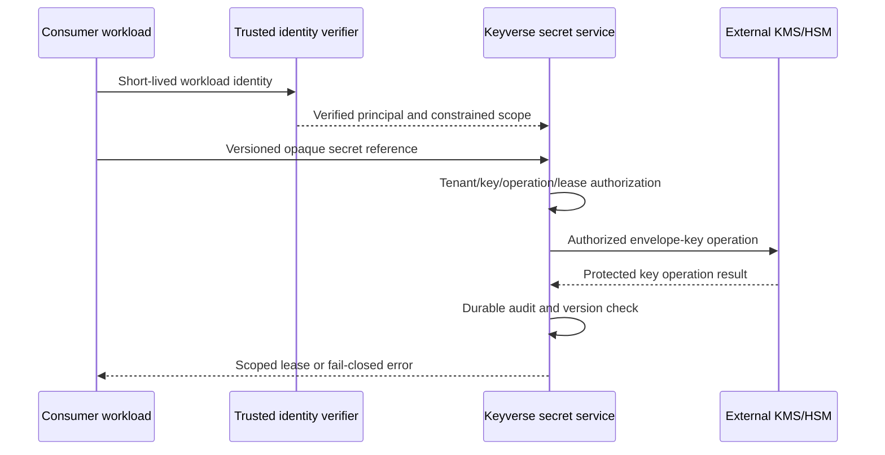

# Keyverse product and technical gap baseline

**Scope:** CWL credential-authority migration, 2026-09-09.
**Status:** active-PR implementation and observed gaps; not release acceptance.
**Canonical owner:** `ContextualWisdomLab/keyverse`.
**Organization migration:** [central #2063](https://github.com/ContextualWisdomLab/.github/issues/2063).

The previous complete 2026-08-21 snapshot is preserved byte-for-byte in
[the historical baseline](product-technical-gap-baseline-2026-08-21.md).
Its PR counts, approvals and Checks are historical evidence, not current gates.
This scoped update does not pretend to have re-audited every identity capability
or every CWL repository.

## Current evidence and decision

Canonical vault PR [#129](https://github.com/ContextualWisdomLab/keyverse/pull/129)
was read at `0f10ac556a318c3c3f5ce7eab0802573ecce0c4c`. It has an encrypted
namespaced store and metadata/write administrator APIs. It does not have a
released, signed-workload credential-resolution API. Its authorization sibling
[#103](https://github.com/ContextualWisdomLab/keyverse/pull/103) remains a separate
owner line; no duplicate authorization implementation is introduced here.

The bounded child implementation at
`4caafd0fa56b9ca377c93d78299bfe82dbec8faf` removes plaintext vault-root loading
from the ordinary config DB, reads a protected supervisor credential, and hides
credential fields from configuration repr. It preserves #129's entire delta.
No consumer is switched to this unreleased branch and no deployed secret is
read, migrated, deleted or rotated by this change.

Keyverse is to be the CWL secret-lifecycle authority, not merely a replacement
name for a plaintext key/value table. Non-secret configuration remains typed
configuration. Identity, service authorization and secret custody remain
separate bounded contexts within the owner product.

## Gap register

| Gap | Evidence / risk | Status and acceptance |
|---|---|---|
| Vault root stored as plaintext configuration | Parent `config.py` reads `keyvault_passphrase` from `idp_config_entries` | Child implementation rejects that entry, accepts only a protected locator; full service/hosted acceptance pending |
| Secret-bearing configuration repr | Parent dataclass includes client/operator/registration/root credentials | Child `field(repr=False)` plus regression tests; arbitrary serialization is still prohibited |
| Safe self-bootstrap | A locked vault cannot obtain its unlock credential through its own API | Explicit root-only supervisor file transport implemented; production KMS/HSM and managed workload identity still missing |
| Cryptographic context separation | Parent fixed installation-wide PBKDF2 salt and value-only ciphertext do not bind tenant/namespace/key/version | Rust envelope-encryption owner work must prove context binding, key separation and cross-context tamper rejection |
| Workload authorization | Administrator access is not consumer read authority | Signature/issuer/audience/subject/tenant/environment/key/version/operation validation and wrong-scope denial required; not implemented here |
| Version and lease lifecycle | Parent overwrites one encrypted value; no immutable secret versions or leases | Add durable version/rotation/revocation/lease records, audit and bounded cache policy |
| Other legacy Keyverse credentials | Client/operator tokens and deployment templates still use historical config/transport | Migrate separately without losing bootstrap/recovery; this PR fixes only vault-root storage and repr |
| Operational confidentiality | Parent review flags metadata caching; backups/WAL may retain retired plaintext root | No-store handling, key rewrap, secure retirement, backup/restore and incident evidence remain mandatory |
| Organization consumers | CO has a CredentialBackend seam; Naruon, LineageWeave and others still expose dotenv entry points in indexed code snapshots | Central #2063 records explicit evidence and owner work; no consumer cutover claimed |
| Release | Feature-head focused tests are not an immutable release | Exact-head full suite, 100% service coverage/docstrings, security checks, independent review, protected merge and release/rollback evidence |

## Verification evidence

The environment reconstructed the exact upstream `bootstrap.py`, `config.py`
and `kv_store.py` blobs and confirmed their Git hashes before changing them.
Initial hostile tests observed 36 failures and one pass. Additional read-race
and atime regressions were observed failing before their corresponding fixes.
The final focused suite has **42 passed** with no failures.

| Published implementation blob | Git blob SHA |
|---|---|
| `services/account_unification/app/bootstrap.py` | `4d368a781f0bfe2fe03f1a9440a1619d9be50d82` |
| `services/account_unification/app/config.py` | `7e45e8e6cc2e127389e912e6d6252c7578b11434` |
| `services/account_unification/tests/test_keyvault_bootstrap_credentials.py` | `c8a51c5423660fd498dca6c2606359d6835ef47c` |

Coverage intersection with changed executable lines is 61/61, with no missing
changed-line branch arcs. This is NOT a claim of 100% coverage of the complete
account-unification service. Python compilation and `git diff --check` pass.
The complete locked dependency suite, Ruff, hosted security Checks, independent
review, deployment acceptance, KMS/HSM and release have not been verified here.

## Product contract and migration sequence

1. Repair and integrate the existing vault foundation through normal reviewed
   PRs; never replace a valid predecessor by closing it without delta transfer.
2. Implement the native Rust secret data plane, trusted workload verification,
   context-bound storage and versioned lease/rotation/audit contracts in Keyverse.
3. Publish immutable owner artifacts and conformance evidence. Cross-domain
   contract metadata may be published through context-graph-contracts; no secret
   value or product-owned private schema is copied there.
4. Connect CO through its existing credential port. Other products call CO for
   provider operations rather than receiving copies of model-provider keys.
5. For each consumer, prove clean startup without `.env`, access denial,
   authority outage, lease expiry/revocation, rotation, recovery and rollback.
   Then retire its old dotenv and plaintext credential entry points.
6. Central `.github` uses released AppGuardrail detection and exact-head
   inventories. Include unreadable/unscanned repositories in the denominator.
   Missing evidence must not be converted into a zero-gap or complete result.

Configuration endpoint/locator values can be transported by environment where
required by an external runtime; application credentials must not depend on
`.env` loading, home-directory discovery or environment fallback. The root-only
exception is documented in [operations](operations/keyvault.md). An authorized
still-valid lease may be used only within its explicit revocation policy;
expired cache, operator-token reuse and fallback secret stores are forbidden.

The required runtime sequence is:

This diagram is the target contract; the implemented child is only the legacy
root-bootstrap repair. It is not a working remote secret-service deployment.
