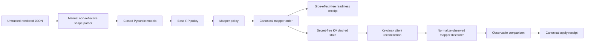

# OIDC Relying-Party Claim Mapper Profile Design

**Status:** Approved for bounded implementation under the protected autonomous
product-development loop.

**Issue:** #70

## Problem

Keyverse now owns a closed, secret-free OIDC relying-party representation and a
durable reconciliation lifecycle. That representation intentionally excludes
Keycloak protocol mappers. `naruon-web` is a runtime desired-state client
restored through Keyverse reconciliation, including its audience and `role`,
`org`, and `workspace` session claims.

Keeping an application client in the portable realm creates two competing
sources of truth:

1. realm import may recreate the client during a rebuild;
2. Keyverse desired state may independently create or update the same client.

The missing product boundary is not a generic Keycloak mapper editor. It is one
small, auditable mapper profile sufficient for ecosystem applications that need
an access-token audience and bounded session-routing claims.

## Goals

- Add an optional `protocolMappers` field to the closed Keycloak
  `ClientRepresentation` accepted by preflight and desired-state PUT.
- Accept exactly one reviewed mapper family: one audience mapper plus optional
  hardcoded `role`, `org`, and `workspace` claims.
- Preserve alias-shaped Keycloak JSON while rejecting arbitrary protocol mapper
  plugins and arbitrary nested configuration.
- Canonicalize mapper order so equivalent desired state has one receipt.
- Ignore Keycloak-generated mapper IDs and returned ordering when observing
  drift, while comparing every product-owned field.
- Keep all accepted data secret-free and locally validated.
- Provide a realistic Naruon runtime template that restores `naruon-web`
  through Keyverse desired-state reconciliation.

## Non-goals

- Generic protocol-mapper administration.
- Script mappers, regex transforms, user-attribute mappers, group mappers,
  address mappers, pairwise-subject configuration, or arbitrary claim names.
- Client-secret generation or retrieval.
- Claim-value authorization or tenant-directory lookup.
- Removal of application RPs from the portable realm was a non-goal of the
  earlier issue #70 work this historical design originally covered.
- A formal OpenID Connect, JWT access-token, or Keycloak conformance claim.

## Closed data contract

`protocolMappers` is optional for backward compatibility. When absent, it is
canonicalized to an empty list. When non-empty, it must contain exactly one
audience mapper followed by zero or more hardcoded claim mappers in the fixed
claim order `role`, `org`, `workspace`.

### Audience mapper

```json
{
  "name": "keyverse-audience",
  "protocol": "openid-connect",
  "protocolMapper": "oidc-audience-mapper",
  "consentRequired": false,
  "config": {
    "included.client.audience": "naruon-web",
    "access.token.claim": "true",
    "id.token.claim": "false",
    "introspection.token.claim": "true"
  }
}
```

The included audience must equal the registration `clientId`. Keyverse does not
use this mapper to modify the ID Token audience; OpenID Connect Core already
requires an ID Token audience containing the relying party client ID. The
mapper exists for the Keycloak access-token resource-audience contract.

### Hardcoded session claim mapper

```json
{
  "name": "keyverse-claim-role",
  "protocol": "openid-connect",
  "protocolMapper": "oidc-hardcoded-claim-mapper",
  "consentRequired": false,
  "config": {
    "claim.name": "role",
    "claim.value": "member",
    "jsonType.label": "String",
    "access.token.claim": "true",
    "id.token.claim": "true",
    "userinfo.token.claim": "false",
    "introspection.token.claim": "true"
  }
}
```

The claim name is one of `role`, `org`, or `workspace`. Mapper names are derived
from the claim name and therefore cannot be freely chosen. Claim values are
trimmed UTF-8 strings of 1–128 Unicode scalar values. Raw C0 controls, DEL,
unresolved template markers, line separators, and leading or trailing
whitespace are rejected. The value is product data, not a secret, and remains
visible in the desired-state response and audit evidence.

## Validation architecture



The manual parser remains the first boundary so malformed nested values are not
reflected by framework validation errors. The parser validates object/list/key
and scalar types before constructing nested Pydantic models.

## Mapper policy

### Shared fields

Every mapper requires exactly:

- `name`;
- `protocol`;
- `protocolMapper`;
- `consentRequired`;
- `config`.

No mapper-level `id` is accepted in desired state. `protocol` is exactly
`openid-connect`, and `consentRequired` is exactly `false`.

### Audience policy

- Exactly one audience mapper exists when the list is non-empty.
- Its name is `keyverse-audience`.
- `protocolMapper` is exactly `oidc-audience-mapper`.
- Its configuration has exactly four fields.
- `included.client.audience` equals the registration `clientId`.
- The mapper writes only access-token and introspection-token audience data.
- ID-token emission remains false.

### Hardcoded-claim policy

- Claim names are limited to `role`, `org`, and `workspace`.
- Each claim appears at most once.
- Mapper name is exactly `keyverse-claim-{claim.name}`.
- `jsonType.label` is exactly `String`.
- Access-token, ID-token, and introspection-token emission are true.
- UserInfo emission is false to avoid expanding the first product profile.
- The configuration has exactly seven fields.

### Ordering

The accepted canonical order is:

```text
keyverse-audience
keyverse-claim-role
keyverse-claim-org
keyverse-claim-workspace
```

Input in another order is rejected rather than silently rewritten. This makes a
reviewed JSON artifact byte-stable and avoids a hidden mutation between
preflight and apply.

## Reconciliation comparison

Keycloak may add an opaque `id` to each mapper and may return mappers in a
different order. Observable comparison therefore:

1. validates each returned mapper as an object;
2. removes only the vendor-generated `id` field;
3. selects exactly the product-owned fields;
4. rejects duplicate or unsupported product-owned mapper identities;
5. sorts by the same canonical mapper rank;
6. compares the normalized list to desired state.

Unknown live mappers are observable drift. Keyverse does not delete them in this
slice by issuing separate mapper API calls; a whole-client update is used, and
post-mutation observation must match the exact closed representation before a
receipt is recorded.

## Failure behavior

- Malformed request shape: bounded HTTP 422 with field-only detail.
- Valid shape but disallowed mapper policy: bounded HTTP 400.
- Duplicate or unsupported live mapper representation: observable drift or
  apply failure; never a false `in_sync` state.
- Keycloak outage: desired intent remains stored and status is `unavailable`.
- Create/update success without exact re-observation: `apply_failed`, no receipt.
- Multiple exact clients: `ambiguous`, no mutation.

No error includes a submitted claim value, bearer token, client secret, or raw
Keycloak response.

## Modularity

The pure parser and validator remain independent of storage and transport.
`RelyingPartyService` depends only on `KvStore` and `RelyingPartyAdminApi`.
Standalone Keyverse, CWL deployment controllers, and Naruon use the same JSON
contract. The feature introduces no database schema; existing multi-word
`snake_case` namespaces remain authoritative.

## Documentation and operations

- Add `deploy/templates/oidc-rp-naruon.json` as a secret-free runtime artifact.
- Update `docs/rp-onboarding.md` and the reconciliation runbook with the mapper
  policy and acceptance-test boundary.
- Update `ARCHITECTURE.md`, `AGENTS.md`, `CLAUDE.md`, and `CHANGELOG.md` when
  implementation changes behavior.
- Add an APA 7th doctoring record separating standard requirements, Keycloak
  vendor representation, product restrictions, measured evidence, assumptions,
  and limitations.

## Testing strategy

### RED baseline

A realistic Naruon payload with `protocolMappers` must fail against the current
closed parser because the field is unsupported. This proves the feature is not
already present.

### Parser and policy tests

- valid audience-only profile;
- valid Naruon audience plus three claims;
- missing and extra nested fields;
- non-object mapper and non-string config values;
- duplicate audience;
- audience not equal to `clientId`;
- duplicate claim name;
- unsupported claim name;
- unsupported mapper type;
- arbitrary mapper name;
- wrong claim destinations or JSON type;
- hostile, unresolved, control-bearing, empty, or oversized claim values;
- noncanonical mapper order;
- no storage, DNS, HTTP, Keycloak, or file side effects.

### Reconciliation tests

- live mapper IDs do not create false drift;
- live mapper order does not create false drift;
- unknown, duplicate, or malformed live mappers remain drifted;
- canonical receipt is independent of JSON object key order but sensitive to
  mapper order and claim values;
- realm rebuild recreates exact mappers;
- changed claim value repairs drift;
- post-update mapper mismatch writes no receipt;
- existing outage, concurrency, duplicate-client, and remote-first delete tests
  remain green.

### Deployment tests

- Naruon template parses as JSON;
- template contains no secret or unresolved mapper type;
- after rendering placeholders, the template passes preflight;
- this PR removes application RPs from the portable realm; `naruon-web` is a
  runtime desired-state client restored through Keyverse reconciliation.

## Merge and release gates

The exact final head must pass:

- locked dependency installation;
- Ruff;
- Python compilation;
- production docstrings 100%;
- complete pytest;
- production statement coverage 100%;
- production branch coverage 100%;
- wheel and source-distribution build;
- realm, Compose, and every deployment-template validation;
- CodeQL, Semgrep, and Security Scan;
- current-head independent review and zero unresolved threads;
- protected merge without administrator bypass.

The change remains under `[Unreleased]`. It does not by itself justify a version,
tag, package publication, or GitHub Release.

## Standards interpretation

- OpenID Connect Core defines ID Token audience semantics and permits additional
  claims. It does not define Keycloak mapper JSON.
- RFC 9068 defines audience validation expectations for JWT access tokens where
  that profile is used; Keyverse records it as security guidance, not as proof
  that Keycloak tokens conform to RFC 9068.
- RFC 8725 provides general JWT implementation guidance, including explicit
  validation and mutually exclusive validation rules.
- Keycloak Admin REST defines `ClientRepresentation` and
  `ProtocolMapperRepresentation`. Exact mapper plugin names and configuration
  keys are vendor behavior and are isolated behind this closed product profile.
